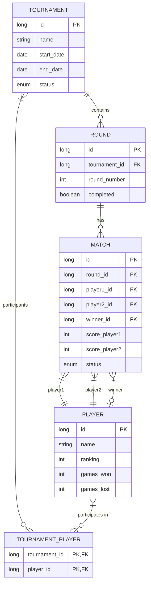

# Turnier Management App

Eine JavaFX-Anwendung zur Verwaltung von Turnieren und Spielerpaarungen.

## Datenmodell

Das Datenmodell der Anwendung basiert auf einer SQLite-Datenbank mit folgenden Entitäten:

### Entitäten

#### Player (Spieler)
- **id**: Eindeutige ID des Spielers
- **name**: Name des Spielers
- **ranking**: Aktuelle Ranglistenposition
- **games_won**: Anzahl gewonnener Spiele
- **games_lost**: Anzahl verlorener Spiele

#### Tournament (Turnier)
- **id**: Eindeutige ID des Turniers
- **name**: Name des Turniers
- **start_date**: Startdatum
- **end_date**: Enddatum
- **status**: Status des Turniers (CREATED, IN_PROGRESS, COMPLETED, CANCELLED)

#### Round (Turnierrunde)
- **id**: Eindeutige ID der Runde
- **tournament_id**: Zugehöriges Turnier
- **round_number**: Rundennummer im Turnier
- **completed**: Status der Runde (abgeschlossen oder nicht)

#### Match (Spielpaarung)
- **id**: Eindeutige ID der Spielpaarung
- **round_id**: Zugehörige Turnierrunde
- **player1_id**: Erster Spieler
- **player2_id**: Zweiter Spieler
- **winner_id**: Gewinner des Spiels
- **score_player1**: Punktzahl Spieler 1
- **score_player2**: Punktzahl Spieler 2
- **status**: Status des Spiels (SCHEDULED, IN_PROGRESS, COMPLETED, CANCELLED)

### Beziehungen

- Ein **Tournament** kann mehrere **Rounds** haben
- Eine **Round** kann mehrere **Matches** haben
- Ein **Match** hat genau zwei **Player** (player1 und player2)
- Ein **Match** kann einen **Winner** haben (optional)
- Ein **Tournament** hat mehrere **Players** über die Verbindungstabelle TOURNAMENT_PLAYER
- Ein **Player** kann an mehreren **Tournaments** teilnehmen